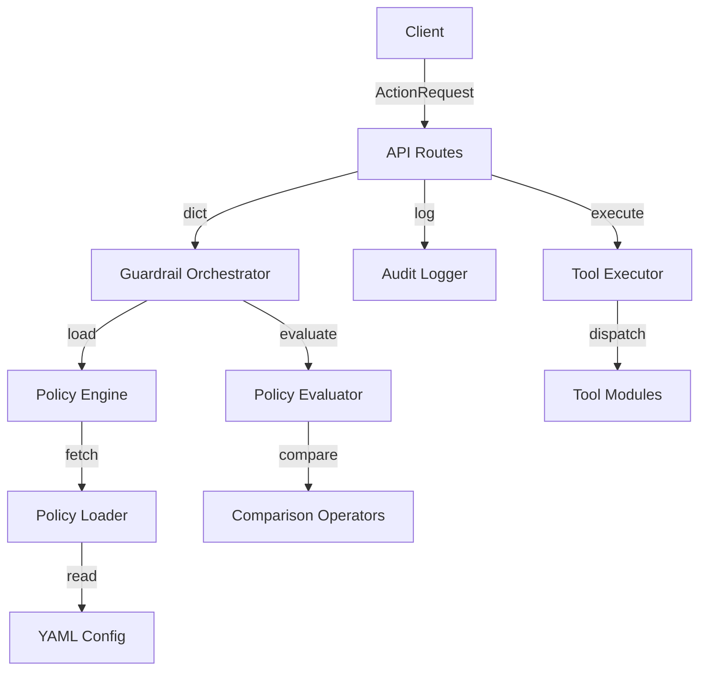

# Guardrail AI Platform Architecture

This document describes the enterprise-grade clean architecture of the **Guardrail AI Platform**.

## Architectural Highlights

- **SOLID Principles**: Each module is designed with a single responsibility. File actions, database delete actions, and emails are fully segregated.
- **Generic Policy Engine**: Evaluation logic is completely decoupled from tool implementations. Adding a rule for a new tool (e.g. Slack) requires zero Python code changes and is configured entirely in YAML.
- **Comparison Operator Layer**: The comparison logic is isolated in a modular `operators.py` module supporting `>`, `<`, `>=`, `<=`, `==`, `!=`, `contains`, `startswith`, and `endswith` checks.
- **HITL Approval Queues**: Defined the `BaseApprovalQueue` abstraction to allow plugging in SaaS or DB approval workflows later.
- **Audit Logging Abstraction**: Decoupled logger interface allowing easy transition from local JSONL logging to database or cloud log collectors.
